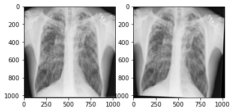
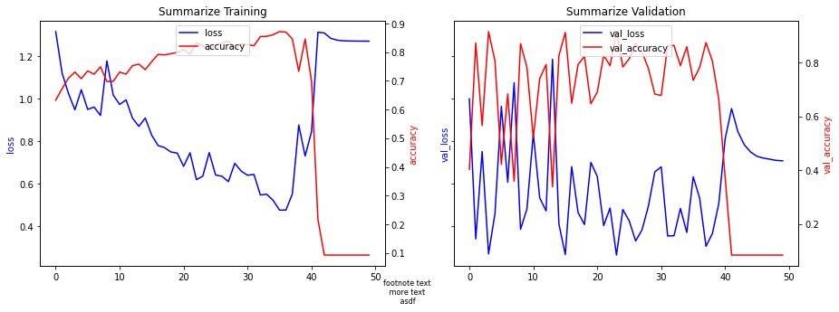
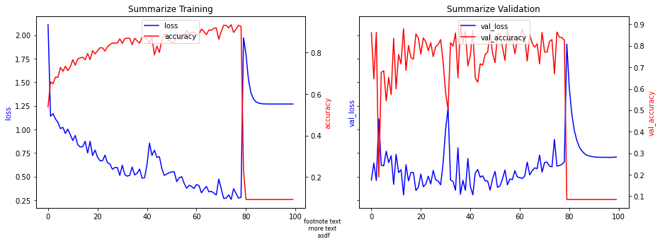
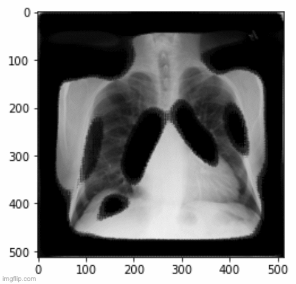
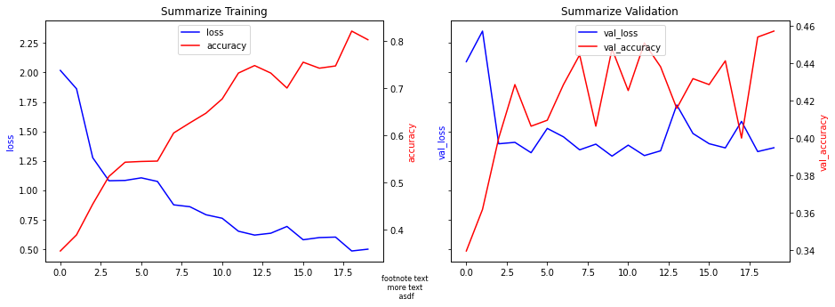
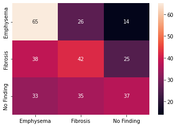

# ILO CXR interpretation
### Alexander White's Capstone
### UTHCT Occupaional Medicine 2023
----
## JOURNAL
#### 8/31
- Downloaded Pantex normals.  I had previous 'flattened' our collection of pantex studies with positive profusions. I did the same with the normal studies and combined them with the positive profusion studies into a file structure that the image loader expects.
- Wrote a python script that loads the models that have been trained on the NIH data and applies them to the Pantex images.  The Pantex images CANT live in the cloud so this script is meant to be run locally.  It is for 'prediction' and not 'fitting' so slow local cpu/gpu not as much as an issue.
#### 8/30
- Met with Dr Rowlett to discuss progress.
- First run on google cloud platform (GCP).  Improvement over google colab because I have a dedicate GPU and the service won't log you out for inactivity or for extended use.  This service does cost $0.44/hr but the first $300 are free.  Other improvement 100GB of storage, storage persists when the VM is stopped, better access to GPUs, jupyter lab, GIT integration.
- First GCP fit results with accuracy over 95%, still running as I type with val_accuracy approaching 70%  
- It might be worthwhile to manually filter out mislabelled NIH CXRs (with my own eyes). I started worked on writing a simple GUI app that would display the images in batches for quick review.  
- Added Tensorboard to code for realtime visualization during a model fit.
#### 8/29
- Busy weekend. Rewrote the oversampling and augmentation code.  I hit a wall with trying to do oversampling via the dataset input pipeline.  See the stackoverflow question I raised on the topic (tehcnical)  https://stackoverflow.com/questions/73513996/using-tensorflow-dataset-for-custom-image-oversampling .  Decided to go the brute force method (duplicating files in storage), so I rewrote that code for both oversampling and augmentation. (Work on the augmentation portion continued from the weekend into this morning.)
- I was also finally granted access to GPUs in google cloud.  Up until now I had been using Google Colab to run the code.  Google Cloud Platform is more professional oriented while google Colab is more educational oriented. One big benefit of GCP is more storage which is persistent (don't need to connect to google drive every time I do something).  Alse seems to have better github integration.
- Work continued on augmentation.  Here is an exaple applying subtle random zoom, translation and rotation one of the fibrosis images.  By appying these transforms randonly to our oversampled imgase it should in theory improve the generalizability of our model fit.   
  
- I received the Pantex normal studies tranche from Mr Reeves (radiolog tech) today.
#### 8/26
- Spent most of the day grappling with a difficult bug related to tensorflow datasets and calculating accuracy after the model has been fit.  It deals with how shuffling is applied to the validation set.  See the (highly techncal) discussion I started here... https://stackoverflow.com/questions/73503162/tensorflow-accuracy-from-model-predict-does-not-match-final-epoch-val-accuracy-o/73504187?noredirect=1#comment129805165_73504187
- Ran a 50 Epoch, 768x768 fit that was coverging on > 90% accuracy... however accidentally loaded an early model state and lost the final fit. When I reran it again found the degenerate solution, foused on just match the heavilty weighted Fibrosis cases.  Here is the 2x2 confusion matrix, where 119 is true positive Fibrosis predictions and 1282 is false positives.  The model makes zero negative (no findings) predictions.
[ 119    0]  
[1282    0]  
Whether the fit false into this trap seems random, but probably more likely the longer it runs.  Again, this is an artifact of using weights to account for the imbalanced data sets (more normals than fibrosis images).  Oversampling fibrosis images will likely solve this, but make the epoch ~ 2x as long to run.  
  
#### 8/25
- Worked on fixing the heat map visualization (Was broken after upgrading input pipeline to tensorflow datasets).
- Researched data augmentation when using the tensorflow dataset pipeline.
- Reshaped the NIH dataset with oversampling.
#### 8/24
- Step over 2 hours this AM setting up Google Cloud's Vertex AI - used for launch AI virtual machines - only to find that the global quota for GPUs for new users is 0.  This service has a non-costomer friendly AWS-like interface.  I requested the quota be lifted to 1, but the autoated reply said this could take 2 or 3 working days.  It is impossible to talk to a human. Maybe I can use this service next week.  Will continue with Colab for now.
- Wrote to Mr Reeves asking for normal studies.
- Updgraded Colab account.  Ran a longer fit on Colab with interesting results.  At this point to handle the imbalance in the Normal vs Fibrosis sets I am using a weighting strategy.  Essentially, since I have 10x the number a normals, during fitting a correct normal image fit is weighted 1/10th the value of a correct Fibrosis image.  However, there is a degenerate local min for the loss function where the fit can mark all (or most) of the Fibrosis images correctly without regards to the results of normals.  One a relatively large fit of 100 Epoch, 768x768 pixel) the fit training accuracy crashed from 92% on Epoch 79 to 9.2% on Epoch 81, where it stayed for the rest of the Epoch. (See plot) I suspect this is due to the imbalanced weights stategy for handling imbalanced sets.  I will try to balance train sets with generative oversampling.
- 
#### 8/23
Tuesday, limited progress due to student meetings & first MPH classes.  I did realize that Mr Reeves from radiology had uploaded the Pantex Fibrosis images.  The folder/file structure is rather chaotic, with some scanned images mixed in with the CXR images.  I wrote a python script that extracts the images from the folders, renames thems with Pantex ID in the file name and places them in a flat folder structure. 
#### 8/22
- Lots of work friday evening, over the weekend and this morning rewriting the way the model works.  The old code read everything into RAM.  Even with virtual memory, this could exceed the total memory of my laptop.  1st rewrite using generators.  It worked but the work flow made it difficult to do custom sample (over/undersampling) to account for the imbalanced clasees (that is we have way more CXRs that are normal than those that have fibrosis).  Plus I noticed that the flow_from_directory functions using generators were actually deprecated in favor of using tensorflow datasets.  So I rewrote using datasers.  Documentation online is, er, sparse. Works currently.  I haven't re-implimented oversampling yet.  Currently it is working with adjusted weights (10x weight given to fibrosis images).
- While running the fitting using the (now scrapped) generator code I noticed, while doing sanity checks on images, that some of the underlying NIH classifications are prettys suspect.  In particular, follow up studies on a particular patient seem to be particularly prone to having findings miscategorized.  For example a few patient may have ~50 follows in a year.  This likely represents a hospitalization were numerous CXRs taken to track progress.  When you look at these CXRs they have many obvious findings (ie large effusions, prominent atelectasis) but they will have been marked as 'No Finding' in the NIH database.  I suspect that the radiologist read of these studies said something like 'no interval change', and that was read as 'No Finding' by the NIH algorithm.  To mitigate this problem, I will only select initial 'No Findings' studies for each patient.  Even with this filter I have more than 10x 'No Findings' compared to Fibrosis studies.
- Rewroked the data directory again, selecting just 'Fibrosis' and 'No Findings' studies.  'No Findings' studies were limited to the 10 times the number of Fibrosis studies and 'no followup studies'
- Got code running on google Colab (cloud).  Much faster! And able to process 1024x1024 images.
#### 8/19  
Overnight ploaded subset of NIH dataset to google drive to be used with google colab. Work on getting code working on cloud to improve computational power.
Reasearch Dealing with imbalanced classes (a lot more normal CXR than abnormals in the NIH dataset).  Excellent resournce at imbalance-learn https://imbalanced-learn.org/stable/introduction.html
- Downsampling.  Will do this to some extent just so I don't have to process 40k+ normal CXRs
- Upsampling (for abnormals just make duplicates until you have equal numbers in each class )
- Combine some down and upsampling (I will probably do this)
- Generative imaging upsampling.  Generate images for abnormals (ie fibrosis) until numbers equal.  
- Ensemble method - Basically splitting the larger classes into subclasses and creating separate models for subclass with the entire dataset of the small class. Then combining all these submodels via some technique (ie majority vote or random forest, etc ). Not very practical in my case where I am considering multiple classes all with different counts
#### 8/18  
UPDATE:
Not good results with the image segmentation (masking).  This was based on a previoulsy published model.  I uploaded the model directly and used the already-set weights.  


Working on image segmentation (masks) today. Some image segmentation resources.  
- Repository that includes hfd5 file for a CXR Image Segmentation - https://github.com/harsha-20/Medical-Image-Segmentation 
- Script for loading the hfd5 file - https://www.kaggle.com/code/eduardomineo/lung-segmentation-of-rsna-challenge-data/notebook 
- ipynb that describes the image segmentation research - https://www.kaggle.com/code/eduardomineo/u-net-lung-segmentation-montgomery-shenzhen/notebook  
Ran overnight 
Image size 512x512
525 images each of Normal, Fibrosis, Emphysema. 20 Epochs.
Total validation accuracy peaked at ~46%, but it was the last epoch (would have improved?)  

  
Ways to improve resuts
- More Epochs?
- Increase image resolution (might try 768 overnight, 1024 overload my computers memory)
- Mask (image segmentation)
- Generative images (could increase data set by ~5x)
- Increase complexity of output layers (currently only one Dense layer).  The more layers ==> more **trainable** parameters ==>  longer the training times.
#### 8/17
- More work on CNN with NIH images.   
- Improved code so save model/weight so that training can be resumed from prior point.
- Briefly met with Dr Rowlett.  Discussed cloud computing for more computer power.  I'd likely try google colab cloud first.
- Wrote code to plot loss & accuracy vs epochs plots for both test and training.
#### 8/16
Called in to OHC clinic.  No progress.
#### 8/15
- Ran several simulations over the weekend with VGG16 as the feature detector (transfer learning) and random forrest as the output layer classifier.  VERY SLOW on my 2012 laptop.  Initially some promise using 512x512 scaled NIH images (normal vs fibrosis) - 67% accuracy, but accuracy got worse (?) on larger 768x768 scale NIH images (only 50%, ie coin toss).  Could only run for 2 epochs due to slowness of money (~3 hours for the 768 images). (See output confusion_matrices folder.)  Will probably change to MNv2 for quicker feature detection and use either a NN output layer or SVM
- Researched Support Vector Machines
  - https://www.baeldung.com/cs/svm-vs-neural-network
  - https://github.com/krishnaik06/Complete-Deep-Learning/blob/master/Image%20Classification%20Using%20SVM.ipynb
- Further work might need to be moved to google Colab for increased performance (at least for public database training)
#### 8/12
- Frustrating AM trying to download the dicom versions of the NIH from the google cloud.  I am just interested to see if the DICOM images are larger than the 1024x1024 pngs.  Unbale to get the "requester pays" request to work.  I requested access to the Google BigData and Google Health Api access points.
- Contacted Dr Ronald Summers, who is the senior NIH investigor in charge of the NIH dataset.  He was unable to help with using google to get larger size images.
- Researched using blended pretrained CNN and traditional machine learning (ie Random Forest).  RF is **faster** and might be better with smalle data sets.  (Pantex dataset is very small, NIH is ~medium sized)
#### 8/11
Worked mostly on rewritting code to use a different Keras Application (pretrain neural network).  Focused on the Xception network, the highest scoring Keras App. Below are network model.summary() statements. Most of the complexity is hidden within the pretrained layer.  Both layers were initially trained on the imagenet dataset.  I retrained both on a flower dataset with 5 types of flower.  I only trained for 2 epochs because it is VERY slow on my computer.  It took 30m13s to train the slower Xception network.  The benefit of Xception over MobileNetV2 is that it can take a 299 by 299 pixel image, while MNv2 can only take a 224 x 224.
```
Model: "model_2"
_________________________________________________________________
 Layer (type)                Output Shape              Param #   
=================================================================
 input_7 (InputLayer)        [(None, 299, 299, 3)]     0         
                                                                 
 xception (Functional)       (None, 10, 10, 2048)      20861480  
                                                                 
 global_average_pooling2d_2   (None, 2048)             0         
 (GlobalAveragePooling2D)                                        
                                                                 
 dense_2 (Dense)             (None, 5)                 10245     
                                                                 
=================================================================
Total params: 20,871,725
Trainable params: 10,245
Non-trainable params: 20,861,480
_________________________________________________________________
```
```
Model: "sequential_1"
_________________________________________________________________
 Layer (type)                Output Shape              Param #   
=================================================================
 keras_layer_1 (KerasLayer)  (None, 1280)              2257984   
                                                                 
 dense (Dense)               (None, 5)                 6405      
                                                                 
=================================================================
Total params: 2,264,389
Trainable params: 6,405
Non-trainable params: 2,257,984
_________________________________________________________________
```

```
Epoch 1/2
86/86 [==============================] - 839s 9s/step - loss: 0.4555 - sparse_categorical_accuracy: 0.8536
Epoch 2/2
86/86 [==============================] - 877s 10s/step - loss: 0.3399 - sparse_categorical_accuracy: 0.8928
<keras.callbacks.History at 0x17cbe0ca0>
```
See CLSFR_Flowers_Xception.ipynb notebooke for code, output
#### 8/10
- Working on Keras CNN with transfer learning
- First working CNN.  Uses a pretrained Keras application to solve know problem (identification of 5 different types of flowers from a data... roses, tulips, etc)
- Mr Reeves has found most of older-than 2008 studies.  Nickie provided some info for him to locate the 2 remaining.  Nickie has found most of the physical film studies; some might be missing the films.
#### 8/9
- In service exam!
- Afternoon board/exam review and meetings.
- Worked on code for transfer learning classification of NIH images (PA normals vs PA fibrosis)
- Lung Segmentation (Masking out everything but lung parenchyma) Research 
  - https://www.kaggle.com/datasets/farhanhaikhan/unet-lung-segmentation-weights-for-chest-x-rays/code
  - https://www.kaggle.com/code/nikhilpandey360/lung-segmentation-from-chest-x-ray-dataset/notebook
#### 8/8
- Researching "transfer learning".  That is were you use parts of state of the art neural networks instead of trying to create an entire NN from scratch.  This are good for tasks such a image categorization, which is what I am doing here. Some good resources.
  - https://keras.io/api/applications/ (list of different networks, aka 'applications')
  - https://www.youtube.com/watch?v=LsdxvjLWkIY
  - https://github.com/codebasics/deep-learning-keras-tf-tutorial/blob/master/18_transfer_learning/cnn_transfer_learning.ipynb
  - https://github.com/nachi-hebbar/Transfer-Learning-Keras/blob/main/TransferLearning.ipynb
  - https://www.youtube.com/watch?v=lHM458ZsfkM
  - https://github.com/aladdinpersson/Machine-Learning-Collection
  - https://www.youtube.com/watch?v=WJZoywOG1cs
#### 8/5
- Interestingly, in NIH dataset there are 648 studies with fibrosis taken in the PA projection.  (Only 79 AP studies)  The PA studies would be more applicable to ILO CXR comparison because those are also PA projection studies.
```
Finding Labels  Edema  Fibrosis  No Finding
View Position                              
AP                577        79       21059
PA                 51       648       39302
```
More work with DataFrames
See read_csv.ipynb for more
#### 8/4
- Working with CSV (comma separated file) which identifies (see read_csv.py)
- Researched dataframes (ie Panda.py)
- Practicum presentations day (all lunch and afternoon)
#### 8/3
- Talked with Nickie regarding best ways to obtain pantex images
- Viewed stack of old x-ray films (pre mid-2008) in the H buildling filing room
- Met with Mr Ross (Rad tech) about obtaining Pantex dicoms directly from PAX
- Mr Ross informed me that radiology no longer has scanner for old x-ray films (physical films)
- Sent list of studies to Mr Ross to obtain (just the studies with + profusion scores).  Aprrox 1/3 of these studies are pre 2008
- Completed download of NIH images
#### 8/2
- Met with Dr Rowlett, planning
- Started NIH images download
----
## References
- Lung Segmentation from Chest X-ray Data: https://www.kaggle.com/code/nikhilpandey360/lung-segmentation-from-chest-x-ray-dataset/notebook
- Prediction of Pulmonary Fibrosis Based on X-Rays by Deep Neural Network:
https://www.ncbi.nlm.nih.gov/pmc/articles/PMC8976624/  
- https://github.com/anshuak100/NIH-Chest-X-ray-Dataset/blob/master/nih%20mobilenet.ipynb